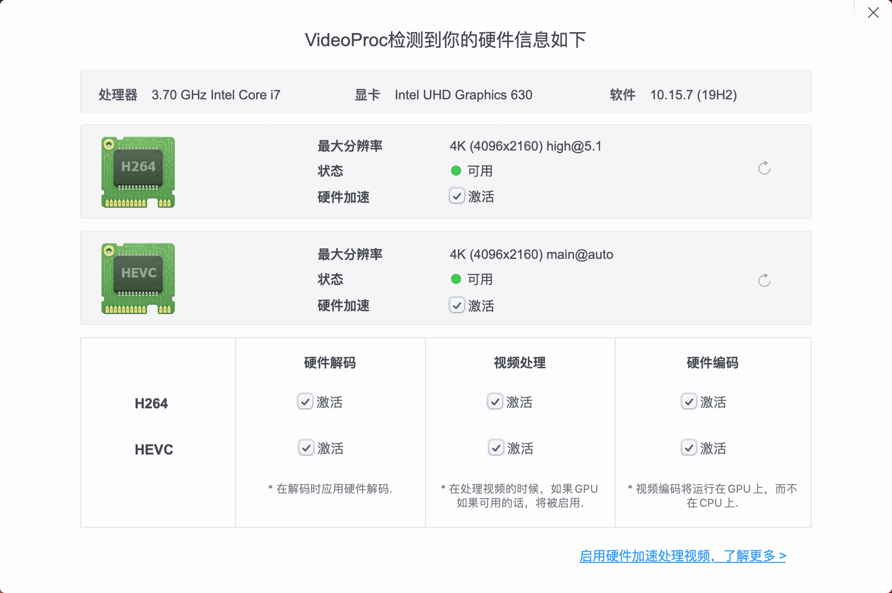
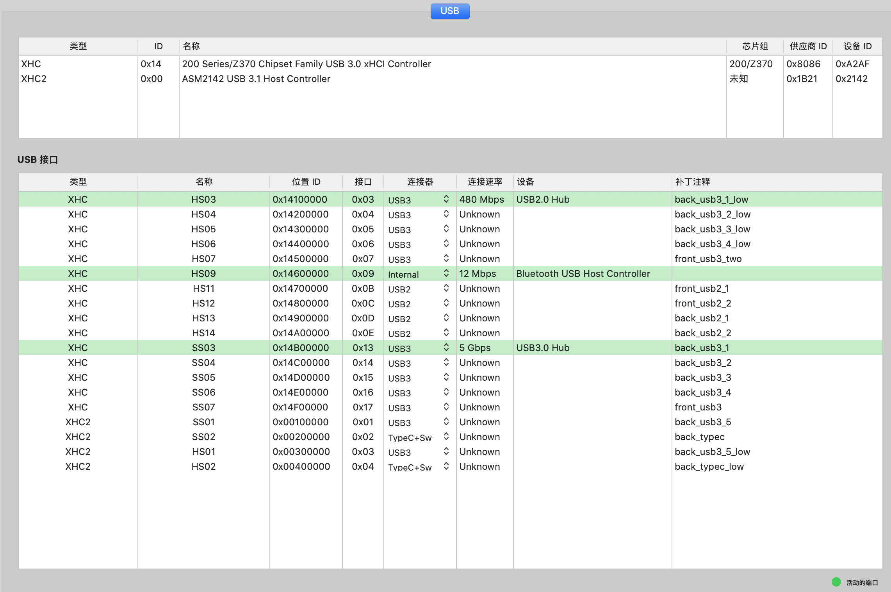
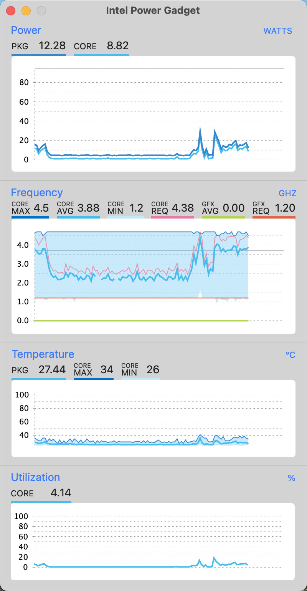

# hackintosh-efi

## 配置
+ 主板：技嘉Z370 AROUS Gaming5(BIOS版本:F7,已解锁CFG)
+ CPU：Intel® Core™ i7-8700K Processor
+ 显卡：蓝宝石 Radeon RX Vega 56 8G HBM2 白金版 OC
+ 内存：威刚ADATA XPG-Z1 3000Hz 8GB * 4
+ 固态硬盘：Intel 545S 512G | LITEON T11 256GB
+ 机械硬盘：TOSHIBA DT01ACA050 500G
+ 蓝牙&无线网卡：Broadcom BCM943602CS

## 更新
+ macOS Big Sur 11.0.1(20B28)
+ [OpenCore](https://github.com/acidanthera/OpenCorePkg/releases) v0.6.3
+ [Lilu](https://github.com/acidanthera/Lilu/releases) v1.4.9
+ [WhateverGreen](https://github.com/acidanthera/WhateverGreen/releases) v1.4.4
+ [AppleALC](https://github.com/acidanthera/AppleALC/releases) v1.5.4
+ [VirtualSMC](https://github.com/acidanthera/VirtualSMC/releases) v1.1.7
+ [IntelMausiEthernet](https://github.com/acidanthera/IntelMausi/release) v1.0.4
+ [CPUFriend](https://github.com/acidanthera/CPUFriend/releases) v1.2.2

## 备注
+ 这款主板在BIOS不能直接关闭CFG，关闭方法在[这里](https://blog.xjn819.com),直接在网页搜索【解锁BIOS中的CFG功能】就能看到。
+ 一旦解锁了CFG,需要在Kernel -> Quirks下，关闭AppleCpuPmCfgLock 以及 AppleXcpmCfgLock

